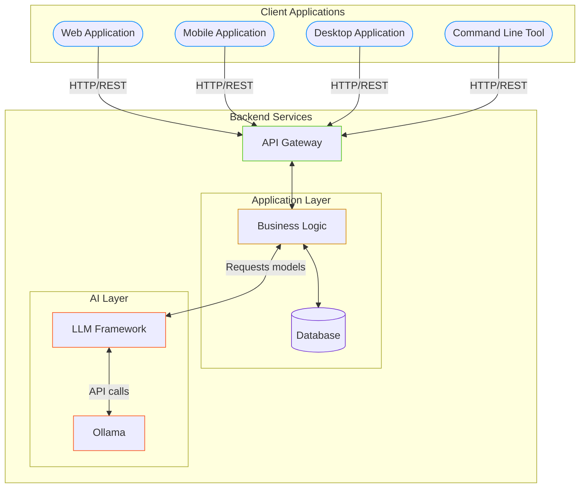

# Introducción Práctica a LLMs con Ollama

## Workshop por [EmaSuriano](https://emasuriano.com)

<div class="abs-br m-6 text-xl">
  <a href="https://github.com/EmaSuriano/workshop-ollama" target="_blank" class="slidev-icon-btn">
    <carbon:logo-github />
  </a>
</div>

---

# ¿Qué haremos hoy?

- Entender qué son los LLMs locales y por qué son importantes
- Instalar y configurar Ollama en tu computadora
- Experimentar con diferentes modelos de lenguaje
- Crear interfaces gráficas para interactuar con tus modelos
- Desarrollar aplicaciones prácticas con IA local

---

# ¿Por qué LLMs Locales?

- **Privacidad**: Tus datos nunca salen de tu computadora
- **Sin conexión**: Funcionan sin necesidad de internet
- **Personalización**: Control total sobre los modelos y parámetros
- **Economía**: Sin costos recurrentes por llamadas a APIs
- **Latencia**: Respuestas más rápidas sin depender de servidores externos

---

# Comparativa: Local vs Cloud

<v-clicks>

| Característica | LLMs Locales | LLMs en la Nube |
|----------------|--------------|-----------------|
| Privacidad     | ✅ Total     | ❌ Limitada     |
| Potencia       | ⚠️ Limitada por hardware | ✅ Alta |
| Costo          | ✅ Gratis/Único | ❌ Suscripción |
| Personalización| ✅ Completa   | ⚠️ Limitada    |
| Facilidad      | ⚠️ Más técnico | ✅ Sencillo    |
| Disponibilidad | ✅ 24/7 Offline | ❌ Requiere internet |

</v-clicks>

---
layout: two-cols-header
---

# Requisitos Técnicos

::left::

## Mínimos:

- CPU moderno (4+ cores)
- 8GB RAM
- 10GB espacio libre
- Sistema operativo compatible

::right::

## Recomendados:

- GPU NVIDIA (CUDA)
- 16GB+ RAM
- 50GB+ espacio libre

---
layout: image-right
image: ./assets/ollama.png
---

# **Ollama**: Tu Plataforma de LLMs Locales

- Framework open source para ejecutar LLMs localmente
- Soporte para múltiples modelos (Llama, Mistral, Phi, etc.)
- API simple y potente
- Interfaz de línea de comandos intuitiva

---
layout: image-right
image: ./assets/ollama-install.png
---

# Instalación de Ollama


Ollama tiene soporte para todos los Sistemas Operativos: 

* [Mac](https://ollama.com/download/mac)
* [Linux](https://ollama.com/download/linux)
* [Windows](https://ollama.com/download/windows)


---

# Primeros Pasos con Ollama

Ollama en si no tiene una interfaz, por lo que la forma de comunicarnos es usando la consola: 

```bash
> ollama

Usage:
  ollama [flags]
  ollama [command]

Available Commands:
  serve       Start ollama
  create      Create a model from a Modelfile
  show        Show information for a model
  run         Run a model
  stop        Stop a running model
  pull        Pull a model from a registry
  push        Push a model to a registry
  list        List models
  ps          List running models
  cp          Copy a model
  rm          Remove a model
  help        Help about any command

Flags:
  -h, --help      help for ollama
  -v, --version   Show version information

Use "ollama [command] --help" for more information about a command.
```

---

# Workflow normal de trabajo con modelos 

<v-clicks every="2">

## 1. Descargar un modelo

```bash
> ollama pull llama3.2
```

## 2. Iniciar una conversación
```bash
> ollama run llama3.2
>>> Hi
How can I help you today?
```

## 3. Consultar desde la terminal

```bash
> ollama run llama3.2 "Contame un chiste bueno"
¡Claro! Aquí tienes uno:
¿Por qué la computadora fue al doctor?
¡Porque tenía un virus!
Espero que te haya hecho sonreír. ¿Quieres escuchar otro?
```

</v-clicks >

---
layout: image-right
image: ./assets/ollama-models.png
---

# Modelos Populares en Ollama

- **Mistral** - Balanceado en tamaño y rendimiento
- **Llama** - Varias versiones y tamaños disponibles
- **Phi** - Compacto pero potente
- **Gemma** - El modelo abierto de Google
- **Deepseek-r1** - Modelo chino con razonamiento

---
layout: image
image: https://media3.giphy.com/media/v1.Y2lkPTc5MGI3NjExbWRwbzU0b2MweDBqdWFjZmU0NzVuMHlveTdiM3BtYWpvOHc0eGJqcSZlcD12MV9pbnRlcm5hbF9naWZfYnlfaWQmY3Q9Zw/fxqt51CAMGITJlxcRI/giphy.gif
---

<!-- Demo Ollama -->

---
layout: quote
---

# "Todo muy lindo, pero esto no se parece a Chat GPT"

-. Dicho por todo el mundo ...

---
layout: iframe-right
url: https://msty.app/
---

# MSTY 

Es la forma más sencilla de usar modelos de IA locales y en línea con integración perfecta de Ollama y sin necesidad de configuración técnica.

## Features

- Sin configuración técnica (sin Docker, sin terminal)
- Compara múltiples respuestas de IA lado a lado
- Importa archivos y conecta fuentes de conocimiento
- Mejor UX para Ollama

---
layout: iframe
url: https://docs.msty.app/getting-started/download
---

# MSTY: Instalación

---
layout: image
image: https://media3.giphy.com/media/v1.Y2lkPTc5MGI3NjExcm5tdnp0dGt1anU2Z2ZwcXBvejhreW42cDZsNm8wODNxOTdpYXJwYSZlcD12MV9pbnRlcm5hbF9naWZfYnlfaWQmY3Q9Zw/WcpaItX5JHYkw/giphy.gif
---

---
layout: quote
---

# "Todo muy lindo, pero como hago una aplicación?"

-. Dicho por los devs ...

---



---
layout: two-cols-header
---

# Stack de una aplicación (real)

::left::

<v-click>

## Frontend

* Web Application: ReactJS
* Mobile Application: Kotlin / Swift
* Desktop Application: Electron
* Command Line Tool: Commander

</v-click>

::right::

<v-click>

## Backend

* API Gateway: FastAPI, Flask, etc.
* Application Layer + Database
* AI Layer: 🎁
* Ollama: ya lo vimos 

</v-click>

---

# Stack de una aplicación (workshop)

## Frontend + Backend

* Frontend: Chainlit / Streamlit ✨
* Application Layer + Database
* AI Layer: 🎁
* Ollama: ya lo vimos 


---

# Streamlit

Streamlit es un framework de Python para construir rápidamente aplicaciones web interactivas para ciencia de datos e inteligencia artificial.

- **Simplicidad**: Crea aplicaciones web con Python puro (sin necesidad de HTML/CSS/JS)
- **Prototipado rápido**: Convierte scripts de datos en aplicaciones web compartibles en minutos
- **Elementos interactivos**: Widgets incorporados para entradas de usuario (deslizadores, botones, entradas de texto)
- **Reactividad**: Actualizaciones automáticas cuando cambian las entradas
- **Visualización de datos**: Integración perfecta con bibliotecas populares de gráficos
- **Gestión de estado**: Estado de sesión para mantener el estado de la aplicación entre ejecuciones
- **Opciones de despliegue**: Fácil implementación a través de Streamlit Cloud u otros servicios

---
layout: full
---

<video controls autoplay loop src="https://s3-us-west-2.amazonaws.com/assets.streamlit.io/videos/hero-video.mp4" />

---

# Chainlit

Chainlit es un framework de Python diseñado específicamente para construir aplicaciones de IA conversacional.

- **Enfocado en aplicaciones LLM**: Optimizado para construir chatbots e interfaces conversacionales
- **Gestión de conversaciones**: Características incorporadas para manejar contextos e historiales de chat
- **Componentes de UI**: Elementos prefabricados para interfaces de chat
- **Transmisión de mensajes**: Soporte para transmitir respuestas desde modelos de lenguaje
- **Multi-modal**: Maneja texto, imágenes y archivos adjuntos en conversaciones
- **Integración con bibliotecas LLM**: Funciona bien con LangChain, LlamaIndex y otros frameworks de LLM
- **Herramientas de depuración**: Herramientas para ayudar a rastrear y depurar la ejecución de aplicaciones LLM
- **Despliegue en la nube**: Opciones de implementación similares a Streamlit

---
layout: full
---

<video controls autoplay loop src="https://mintlify.s3.us-west-1.amazonaws.com/chainlit-43/images/overview.mp4" />

---

# Tabla de Decisión


| **Necesidad** | **Mejor Opción** |
|---------------|------------------|
| Aplicación de chat o conversacional | Chainlit |
| Visualización de datos | Streamlit |
| Tableros interactivos | Streamlit |
| Interfaces para modelos ML | Streamlit |
| Integración avanzada con LLMs | Chainlit |
| Mayor comunidad y recursos | Streamlit |
| Interfaces optimizadas para chat | Chainlit |


---

# Guía Rápida

##  **Streamlit** para: aplicaciones de datos, visualizaciones y dashboards
##  **Chainlit** para: chatbots e interfaces conversacionales

---
layout: section
---

# asdasd


---
layout: image-right
image: ./assets/chainlit.png
---

# Chainlit

asdasd


---
layout: full
---

<video controls>
  <source src="https://mintlify.s3.us-west-1.amazonaws.com/chainlit-43/images/overview.mp4" type="video/mp4">
</video>


---

# Interfaces de Usuario: Streamlit


- Framework Python para crear aplicaciones web interactivas
- Perfecto para prototipos rápidos
- Componentes interactivos integrados
- Fácil visualización de datos

---

# Ejemplo Básico con Streamlit

```python
import streamlit as st
from ollama import Client

st.title("Mi Asistente con LLM Local")

# Inicializar cliente de Ollama
client = Client(host="http://localhost:11434")

# Interfaz de usuario
prompt = st.text_input("Tu pregunta:", 
                     placeholder="¿Qué quieres saber?")

if st.button("Generar respuesta"):
    with st.spinner("Pensando..."):
        response = client.chat(model="mistral", 
                            messages=[{"role": "user", "content": prompt}])
        st.write(response["message"]["content"])
```

---

# Componentes Interactivos de Streamlit

- **Entradas**: Text inputs, sliders, selectors
- **Visualización**: Charts, tables, maps
- **Media**: Images, audio, video
- **Layouts**: Columns, tabs, expandable sections
- **Estado**: Session state para persistencia
- **Deployment**: Fácil de implementar en la nube

---

# Demo: Interfaz Avanzada

- Selección de modelos
- Historial de chat persistente
- Configuración de parámetros (temperatura, tokens)
- Exportación de resultados
- Visualización de latencia y tokens

---

# Agentic AI con phidata


- Framework para construir agentes AI autónomos
- Integración directa con Ollama
- Workflows inteligentes
- Personalizable y extensible

---

# Creación de un Agente Básico

```python
from phi.assistant import Assistant

# Crear un asistente con modelo local
assistant = Assistant(
    name="Asistente Python",
    llm="ollama/codellama",
    description="Experto en Python y resolución de problemas",
    instructions="""
    - Ayuda con código Python
    - Explica conceptos de programación
    - Sugiere buenas prácticas
    """
)

# Interactuar con el asistente
response = assistant.run("Escribe una función que calcule fibonacci")
print(response)
```

---

# Funcionalidades de los Agentes

- **Memoria**: Recordar conversaciones previas
- **Herramientas**: Acceso a APIs, bases de datos, búsqueda
- **Workflows**: Secuencias automáticas de tareas
- **Retroalimentación**: Aprendizaje por refuerzo
- **Multi-agente**: Colaboración entre agentes

---

# Desarrollo de APIs con FastAPI


- Framework moderno para APIs en Python
- Alto rendimiento con Async/Await
- Documentación automática con Swagger
- Validación de datos integrada
- Fácil integración con Ollama

---

# Ejemplo de API con FastAPI

```python
from fastapi import FastAPI, HTTPException
from pydantic import BaseModel
from ollama import Client

app = FastAPI()
client = Client()

class Query(BaseModel):
    prompt: str
    model: str = "mistral"
    temperature: float = 0.7

@app.post("/generate")
async def generate_response(query: Query):
    try:
        response = client.chat(
            model=query.model,
            messages=[{"role": "user", "content": query.prompt}],
            temperature=query.temperature
        )
        return {"response": response["message"]["content"]}
    except Exception as e:
        raise HTTPException(status_code=500, detail=str(e))
```

---

# Integración Frontend-Backend

- **React/Vue/Angular**: Frontend moderno
- **WebSockets**: Para streaming de respuestas
- **Gestión de estado**: Control de sesiones y contexto
- **Responsivo**: Adaptable a móviles y desktop
- **Microservicios**: Arquitectura escalable

---

# Mejores Prácticas

- **Optimización de prompts**: Instrucciones claras y específicas
- **Gestión de contexto**: Limitar tamaño para rendimiento
- **Caching**: Almacenar respuestas comunes
- **Monitoreo**: Tracking de uso y rendimiento
- **Fallbacks**: Plan B cuando el modelo falla
- **Feedback loop**: Mejora continua basada en uso real

---

# Casos de Uso Prácticos

- **Asistente de programación personal**
- **Análisis de documentos locales**
- **Generación de contenido sin conexión**
- **Chatbots personalizados para equipos**
- **Automatización de tareas repetitivas**
- **Educación y entrenamiento interactivo**

---

# Recursos Adicionales

- [Documentación de Ollama](https://github.com/ollama/ollama)
- [Streamlit Tutorial](https://docs.streamlit.io/)
- [FastAPI Documentation](https://fastapi.tiangolo.com/)
- [Phidata Agents Guide](https://docs.phidata.com/)
- [Hugging Face - Modelos Open Source](https://huggingface.co/)
- [Comunidad Discord Workshop](https://discord.gg/workshop)

---

# Actividad Práctica

1. Instala Ollama y descarga un modelo
2. Crea una interfaz simple con Streamlit
3. Implementa una funcionalidad específica
4. Presenta tu proyecto al grupo

¡Tienes 45 minutos!

---

# ¡Gracias por Participar!

## Contacto:
- Email: workshop@example.com
- Twitter: @workshop_ai
- GitHub: github.com/workshop-ai

## Próximos Eventos:
- Embeddings y recuperación de información
- Fine-tuning de modelos locales
- Deployment en producción

---
layout: fact
---

# Q&A